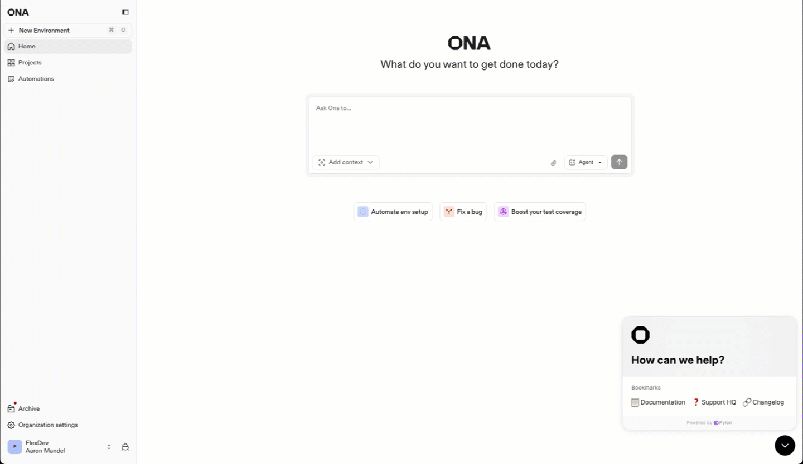
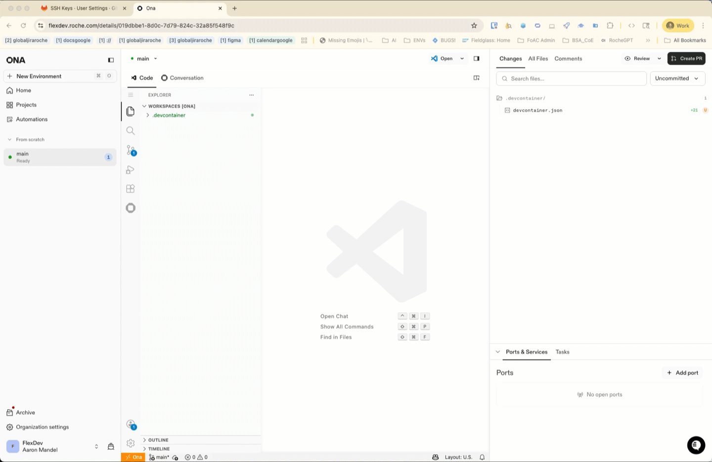
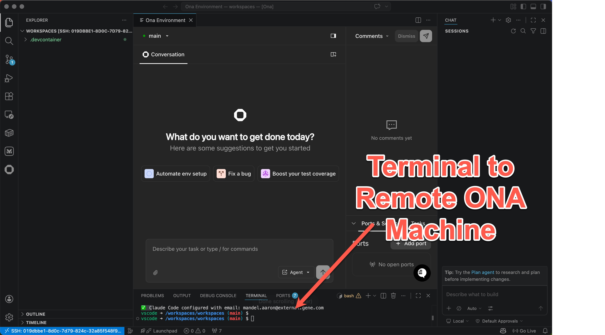
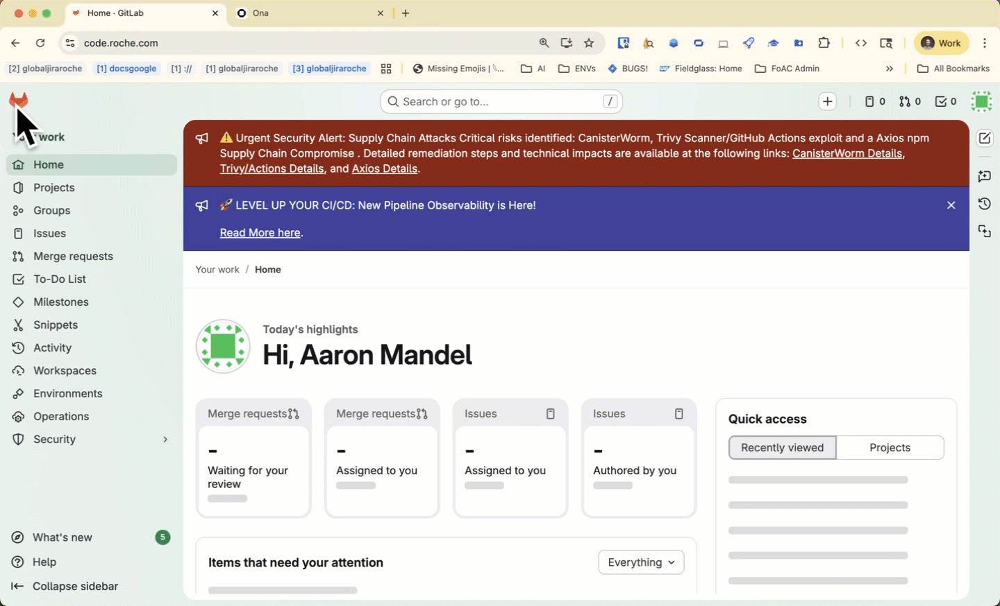
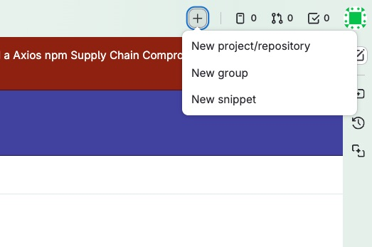
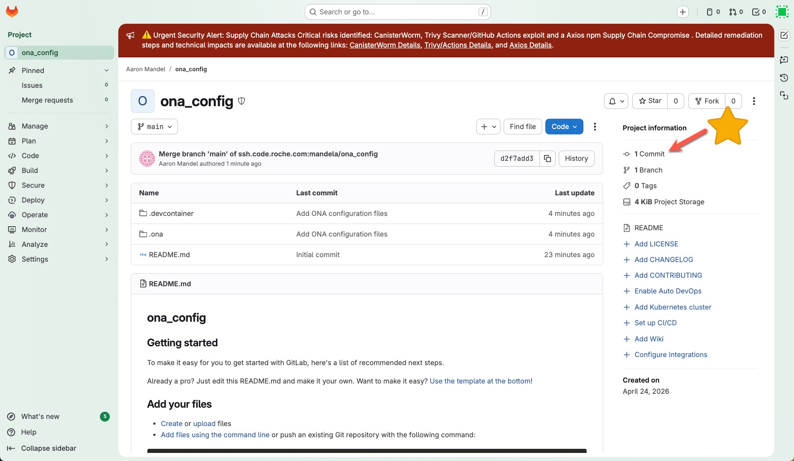
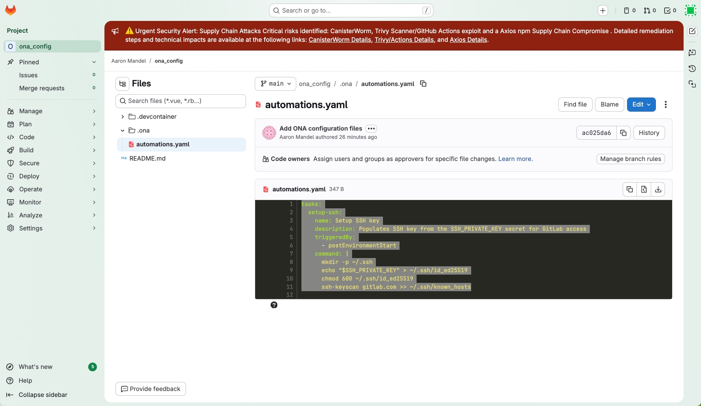
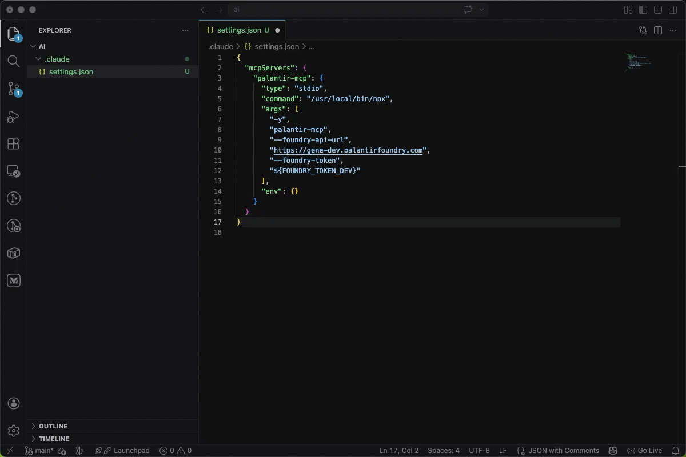

# Agentic Engineering Knowledge Base

> **Agents First** -- AI agents are not just coding assistants. They are first-class participants in our Software Development Lifecycle, fully enabled by our tooling, processes, and engineering culture.

## What This Is

This knowledge base captures best practices, patterns, and guidance for embedding AI agents into every stage of the SDLC. The goal is to move beyond "chat with a copilot" toward a model where agents are deeply integrated into how we design, build, test, and ship software.

This guide starts in gitlab and connect gitlab to ONA, then flexdev to illustrate these concepts. Upon the initial connection to ONA we will create a blank project and get access to a sandbox + claude chat agent but in a real application we will repeat these steps and connect to an ONA project prepopulated with the customized Claude code harness tailored to our team's AI assets (like data, code, architecture, and design knowledge/standards).

## Platforms & Environments

| Resource                                   | Link                                          | Add'l Info                                                                                                                                                                                                                                                                                                                               |
| -------------------------------------------| ----------------------------------------------|------------------------------------------------------------------------------------------------------------------------------------------------------------------------------------------------------------------------------------------------------------------------------------------------------------------------------------------|
| FlexDev (Cloud Development Environments)   | [flexdev.roche.com](https://flexdev.roche.com)|[Getting Started with ONA (FlexDev)](https://build.roche.com/catalog/default/component/ona-environments/docs/documentation/Gitpod_Flex/GettingStartedOna/) FlexDev provides on-demand cloud development environments pre-configured for agentic workflows. Use it to get a consistent, agent-ready workspace without local setup overhead.|
| Code Repository (Gitlab)                   | [code.roche.com](https://code.roche.com/)     | Roche uses Gitlab, hosted in Roche to store your sourcecode                                                                                                                                                                                                                                                                              |

## Prerequisites

* Ensure chrome is set as your default browser
* Install [Microsoft VS Code](https://code.visualstudio.com/download)

## Initial setup

The following detailed section will walk you through the setup of gitlab, ona, and even a local ide. We will create a key pair in the [development env](https://flexdev.roche.com/). We will use this to securely connect to the gitlab environment.

### Start ONA Environment

In a browser log into the [ONA environment](https://flexdev.roche.com/)
Once authenticated, we need an environment where we can run some commands. Create New Environment, create a small environment, and get a cup of tea because the system will take a couple minutes to provision a virtual machine where you will be doing development work.


Once the ONA environment has been initialized, we will be working with it through a local Integrated Development Environment (IDE) - VSCode. This will offer performance advantages, the ability to connect to multiple concurrent repositories, and other advantages.


### Create a keypair in ONA

When the ONA machine starts, we'll write the following command in the terminal connected to the ONA machine :
```bash
ssh-keygen -t ed25519 -C "your_email@gene.com"
```


This will create a private/public key pair for your user account on the remote machine.  Now we want to copy the public key because we will push that to gitlab. In the future, when the ONA machine talks to the gitlab server, the two machines will verify authenticity through the public/private cryptograhic keys.

Type this command in the terminal and copy the output to your clipboard:
cat ~/.ssh/id_ed25519.pub

the text will look like this:

```bash
ssh-ed25519 AAAAC3NzaC1lZDI1NTE5AAAAIGBkwQ2WvjpcYjOsNnxcR4F8cgp1h7+16QndSSc57Vh3 mandela@external.gene.com
```

### Push the public ONA key to gitlab

In a browser, log in to to https://code.roche.com
in the upper right click on your user icon > preferences
In your gitlab user preferences menu, go to SSH keys and we're going to "add a new key".


### While in gitlab create a private repo to store ONA config changes

Now to consistently edit your ona setup we need to leverage a gitlab repository where we store the instructions.
on code.roche.com we will create a new repository.
Put the new project in your local space and give it a name to indicate ona configuration.

In the terminal of the Ona machine let's configure git to connect to the remote repository:

```bash
git config --global user.email "mandela@external.gene.com" && git config --global user.name "Aaron Mandel"
git remote add origin https://code.roche.com/mandela/ona_config.git
git branch -M main
git pull --allow-unrelated-histories --no-rebase origin main
git push -uf origin main
git commit -m "add ONA configuration files to personal ona config repo"
```

Look in gitlab and you'll be able to confirm the commit worked.


### Finally, in ONA we need to persist the private key

Now back in the terminal get a copy of the private key:
```bash
cat ~/.ssh/id_ed25519
#This will create 7 lines of text that starts "-----Begin"
# Copy the text from the terminal to your clipboard.
```
Copy the text from the terminal to your clipboard.

Now, in a browser go to https://flexdev.roche.com (the ONA dashboard) > settings > ssh keys
and upload your private key

now go to the ONA dashboard > settings > Secrets > New Secret
Name: SSH_PRIVATE_KEY
Secret type: Environment variable
value: {paste private key here}

### Tie everything together

In this final step we will add a script that will run every time an ONA machine starts and the script will set the private key to the machine.

In your ONA configuration repository create a .ona folder and in that folder create a file called automations.yaml
place this text in the automations.yaml:
```yaml
tasks:
  setup-ssh:
    name: Setup SSH key
    description: Populates SSH key from the SSH_PRIVATE_KEY secret for GitLab access
    triggeredBy:
      - postEnvironmentStart
    command: |
      mkdir -p ~/.ssh
      echo "$SSH_PRIVATE_KEY" > ~/.ssh/id_ed25519
      chmod 600 ~/.ssh/id_ed25519
      ssh-keyscan gitlab.com >> ~/.ssh/known_hosts
```


Commit the automations.yaml to the ona_config repository.

## Setting Up palantir-mcp

In this walkthrough, we will configure a model context protocol (MCP) to connect the code your agent writes to data assets in Palantir. This program will spell out the steps to configure our tools to provide the access credentials appropriately and we will see how to  define the actions available to agents outside the Palantir ecosystem.

We start this work in the IDE and push the code to our repository.

`palantir-mcp` gives agents direct access to Foundry -- documentation, datasets, ontologies, and more. This is especially valuable during the design phase (see Best Practice #1) where an agent can read through existing resources and help you prototype.

### Prerequisite: confirm your account has access to foundry assets

1. **Log in to foundry's dev environment via gene-dev.** Go to [gene-dev.palantirfoundry.com](https://gene-dev.palantirfoundry.com) and confirm you can access the resources you need (datasets, ontologies, documentation).
2. **Ensure your dev user has the right permissions.** Your gene-dev user may not mirror your production user by default. If you can't access the resources you need, work with the admin team to update your dev user permissions to match your prod user (can we list point of contact here?).
3. **Authenticate ONA to access Palantir** In gene-dev, generate a token with the scopes needed for your workflow.


### Configuration

Add the following to your `.claude/settings.json` (or project-level `.claude.json`):

```json
{
  "mcpServers": {
    "palantir-mcp": {
      "type": "stdio",
      "command": "/usr/local/bin/npx",
      "args": [
        "-y",
        "palantir-mcp",
        "--foundry-api-url",
        "https://gene-dev.palantirfoundry.com",
        "--foundry-token",
        "${FOUNDRY_TOKEN_DEV}"
      ],
      "env": {}
    }
  }
}
```



This file should be **committed to the repository** so every team member gets the same MCP configuration automatically.

### Node.js Requirement

`palantir-mcp` requires Node.js to run via `npx`. If your ONA environment does not have Node.js installed, you can add it via a setup script referenced from your `devcontainer.json`:

In `devcontainer.json`, point `onCreateCommand` to a setup script:

```json
{
  "onCreateCommand": "bash /workspaces/<your-repo>/.devcontainer/setup.sh"
}
```

Then create `.devcontainer/setup.sh` with the following content:

```bash
# Install Node.js 22
curl -fsSL https://nodejs.org/dist/v22.14.0/node-v22.14.0-linux-x64.tar.xz | tar -xJ -C /tmp
sudo cp -r /tmp/node-v22.14.0-linux-x64/bin/* /usr/local/bin/
sudo cp -r /tmp/node-v22.14.0-linux-x64/lib /usr/local/
node --version
```

### Token Management

The `FOUNDRY_TOKEN_DEV` environment variable is resolved at runtime from your ONA environment secrets. To set it up:

1. Go to **User Settings > Secrets** in your ONA configuration.
2. Create a new secret with:
   - **Name:** `FOUNDRY_TOKEN_DEV`
   - **Value:** Your gene-dev personal access token
   - **Type:** Select **Environment Variable** (this is important -- it ensures the secret is injected as an env var in your dev environment)
3. Start (or restart) your FlexDev environment. The token will be available as `${FOUNDRY_TOKEN_DEV}` and automatically picked up by the `.mcp.json` configuration.

### Context Token Usage

`palantir-mcp` injects a substantial amount of context into every conversation -- approximately **50,000 tokens** when active. This significantly reduces the effective context window available for your actual work.

**Recommendation:** Keep `palantir-mcp` disabled by default and enable it only for sessions where you need Foundry access (e.g., design-phase exploration, ontology work).

Add the following to your `settings.local.json` to keep it disabled by default while still allowing other project MCP servers to load:

```json
{
  "enableAllProjectMcpServers": true,
  "disabledMcpjsonServers": [
    "palantir-mcp"
  ]
}
```

When you need Foundry access, enable it explicitly for that session.

## Best Practices

### 1. Design First, Build Second

Don't jump into code. Use your agent as a design partner before writing a single line of implementation.

- **Create architecture and design documents up front.** Write them in Markdown so agents can read, reference, and iterate on them naturally. Start with a high-level architecture doc, then break it into smaller focused design docs (e.g., `docs/architecture.md`, `docs/design/auth-flow.md`, `docs/design/data-pipeline.md`).
- **Iterate on design with the agent in context of business requirements.** Share the business requirements and ask the agent to critique, refine, and challenge your design. The agent can spot gaps, suggest alternatives, and pressure-test edge cases -- all before any code exists.
- **Use Mermaid diagrams where visuals help.** Sequence diagrams, entity-relationship diagrams, component diagrams -- agents can generate and refine these in Markdown. Visuals make designs easier to review with stakeholders and serve as living documentation. Use [mermaid.live](https://mermaid.live) or [Lucidchart](https://www.lucidchart.com) to render and share the diagrams Claude produces.

  **Example -- describe the flow, let Claude generate the diagram:**

  > *"Create a Mermaid sequence diagram showing: the user submits a form, the frontend sends a POST to the API gateway, the gateway validates the auth token with the auth service, then forwards the request to the order service, which writes to the database and returns a confirmation back through the chain."*

  Claude will produce something like:

  ```mermaid
  sequenceDiagram
      actor User
      participant FE as Frontend
      participant GW as API Gateway
      participant Auth as Auth Service
      participant Orders as Order Service
      participant DB as Database

      User->>FE: Submit form
      FE->>GW: POST /orders
      GW->>Auth: Validate token
      Auth-->>GW: Token valid
      GW->>Orders: Create order
      Orders->>DB: INSERT order
      DB-->>Orders: OK
      Orders-->>GW: Order confirmed
      GW-->>FE: 201 Created
      FE-->>User: Show confirmation
  ```

  Paste the output into [mermaid.live](https://mermaid.live) to visualize and iterate. Describe changes to Claude in plain language (e.g., *"add a retry if the database write fails"*) rather than editing the Mermaid syntax yourself.
- **Design your data model explicitly.** If your system has a data model, design it as a first-class artifact. Agents can understand existing ontologies, reason about relationships, and even prototype new ontology structures based on your design.
- **Use platform-specific MCP tools to accelerate.** For example, use `palantir-mcp` to give agents access to Foundry documentation, existing datasets, and ontologies. Let the agent read through what already exists and draft a prototype ontology aligned with your design -- before you commit to building anything.
- **Mature the design before the first line of code.** A few hours iterating on design with an agent saves days of rework. Treat the transition from design to build as a deliberate gate, not a gradual drift.

### 2. Use Plan Mode for Complex Features

When building non-trivial features, use Claude Code's **plan mode** to think through the implementation before writing code.

- **Reference your design and architecture docs.** Point Claude at your architecture doc, relevant design docs, and describe the feature you want to build. The richer the context, the better the plan.
- **Have Claude create a plan.** Claude will explore the codebase, understand existing patterns, and produce a step-by-step implementation plan with the files and changes involved.
- **Review the plan carefully.** Read through the proposed approach. Check that it aligns with your architecture, doesn't miss edge cases, and follows existing conventions.
- **Iterate on the plan by chatting, not editing.** If something needs to change, tell Claude what to adjust -- don't manually edit the plan file. This keeps Claude's understanding in sync with the plan content.
- **Once satisfied, approve and build.** Choose the option to clear context and let Claude execute the plan with a fresh context window dedicated to implementation. This separation of planning and building keeps both phases focused.
- **Review the results.** After Claude builds from the plan, review the generated code. The plan gives you a checklist to verify against -- confirm each planned step was implemented correctly.

### 3. Commit Often, Keep Branches Focused

Don't pile multiple agent-built features onto a single branch. Work in small, reviewable increments:

- **One feature per branch.** If an agent helped you build it, commit the result as soon as you're satisfied.
- **Commit after each meaningful change.** Agents can produce large diffs quickly -- frequent commits keep history clean and reversible.
- **Review before committing.** Agent output is a draft, not a final product. Read what was generated, understand it, then commit.

### 4. Manage Your Context Window

Agents only know what is in their context. Everything outside the context window effectively does not exist.

- **Add a statusline to your terminal** so you can see token usage and context state at a glance. This helps you know when to start a fresh conversation vs. continue.
- **Be aware of context limits.** When context gets large, agents lose track of earlier information. Start new sessions for new tasks rather than overloading a single conversation.
- **Disable expensive MCP servers when not needed.** Some MCP servers (e.g., `palantir-mcp`) consume ~50k tokens just by being active. Keep them disabled by default and enable only when required. See the [palantir-mcp Context Token Usage](#context-token-usage) section for the recommended default configuration.
- **Provide relevant context explicitly.** Don't assume the agent "remembers" previous sessions or knows about files it hasn't read.

### 5. Structure Your AGENTS.md / CLAUDE.md as a Dictionary, Not an Encyclopedia

Your project-level agent instructions file (e.g., `CLAUDE.md`, `AGENTS.md`) should act as an index that points to detailed documentation -- not contain everything inline.

**Do:**

- Keep it concise with short descriptions and links to deeper docs.
- Reference architecture decision records, API docs, and style guides by path or URL.
- Include only the essentials: build commands, test commands, key conventions, and pointers.

**Don't:**

- Paste entire style guides, API schemas, or architecture docs directly into the file.
- Let it grow beyond what an agent can reasonably process in a single context load.

### 6. Embrace Test-Driven Development (TDD)

Agents excel at TDD when you structure the workflow correctly. Write tests first, then build.

- **Have agents write unit tests from requirements before implementation.** Share the design doc or feature spec and ask the agent to produce the test suite first. Tests encode the expected behavior and become the contract the implementation must satisfy.
- **Run the full test suite as part of every PR.** Agents should execute tests before submitting and confirm all pass. A PR with failing tests should never be submitted for review.
- **Use tests as a feedback loop.** When an agent builds the implementation, it should run the tests continuously and iterate until they pass. This keeps the agent focused on correct behavior rather than "looks right" code.

### 7. Use Agents for PR Creation and Review

Leverage multiple agents (or agent sessions) to separate the roles of author and reviewer. This creates a feedback loop that catches issues before human review.

- **Use one agent to build and submit the PR.** The authoring agent creates the feature branch, implements the change, runs the test suite, and opens a pull request with a clear description.
- **Use a second agent to review the PR.** A separate agent session (with fresh context) reviews the diff, checks for correctness, style, security issues, and alignment with the design. It leaves review comments directly on the PR.
- **Iterate until all gates pass.** The original agent incorporates the review feedback, updates the PR, and the reviewer agent reviews again. Repeat this cycle until the review is clean and the test suite passes. Only then does the PR go to a human for final approval.
- **Agents should run the test suite as part of review.** The reviewing agent doesn't just read code -- it checks out the branch, runs tests, and validates that everything works end-to-end.

### 8. Treat Agent Output as a Starting Point

Agents accelerate your work, but engineering judgment is still yours.

- **Read and understand generated code** before merging. You own what ships.
- **Run tests.** If the agent wrote tests, verify they actually test the right behavior.
- **Watch for hallucinated dependencies or APIs.** Agents can confidently reference things that don't exist.

### 9. Enable Agents in Your Tooling

To get the most out of agents, your environment should support them:

- **Pre-configure repos** with `CLAUDE.md` / `AGENTS.md` files so agents have immediate context.
- **Use cloud dev environments** (like FlexDev) where agent tooling is pre-installed and consistent across the team.
- **Automate repetitive setup** -- the less time an agent spends on boilerplate, the more it can focus on the actual task.
- **Connect agents to platform tools via MCP.** Give agents access to documentation, datasets, and platform APIs through MCP servers (e.g., `palantir-mcp` for Foundry). The more context agents have about your platform, the better their output.

## Contributing

This is a living document. If you've found a pattern that works well (or a pitfall to avoid), open a merge request and share it with the team.
